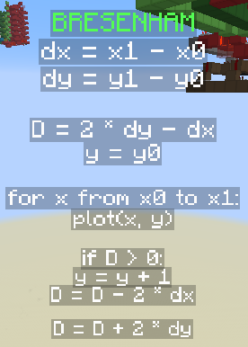
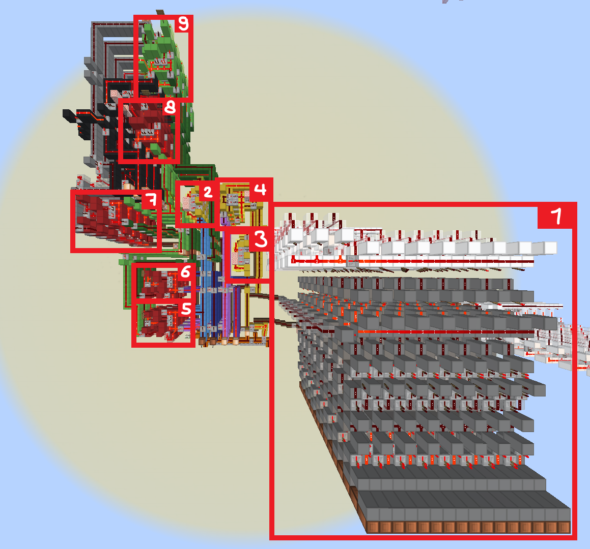
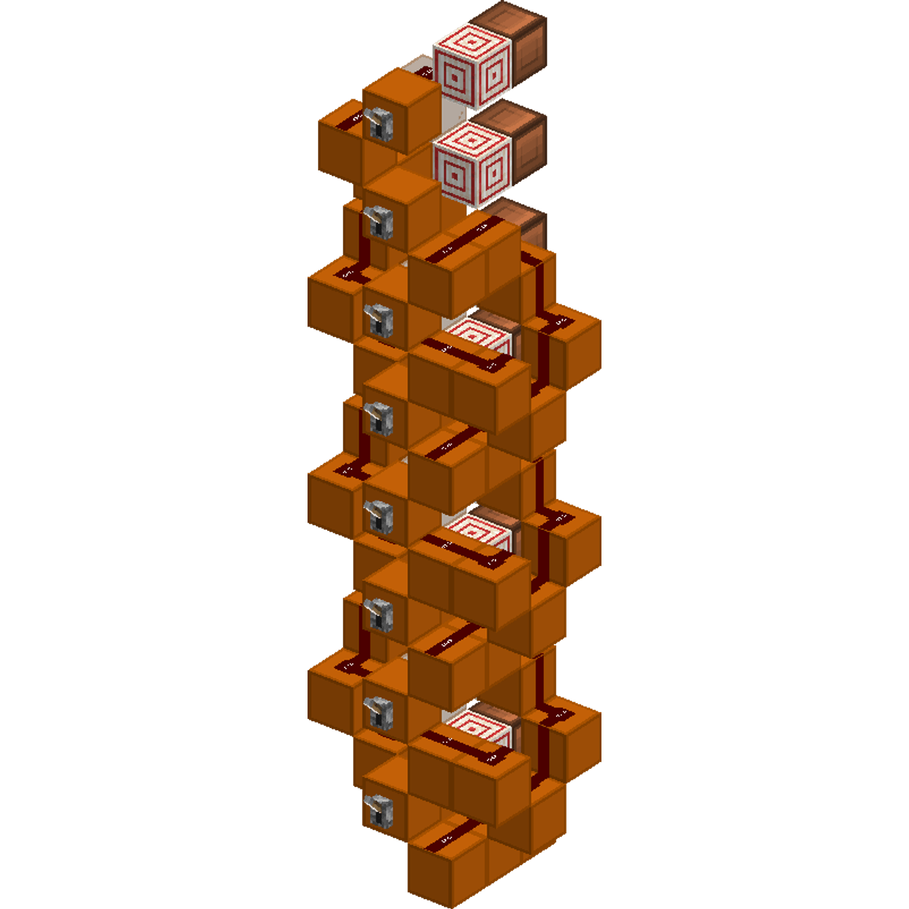
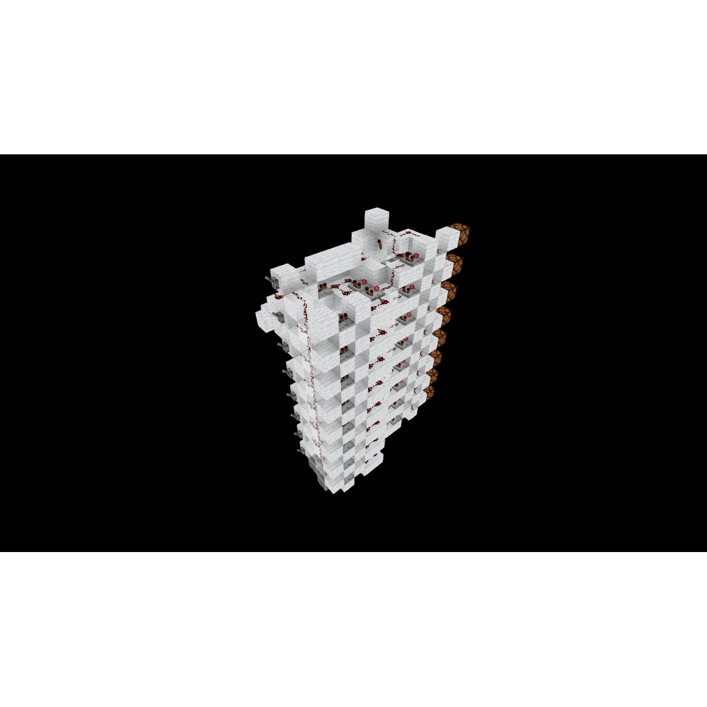
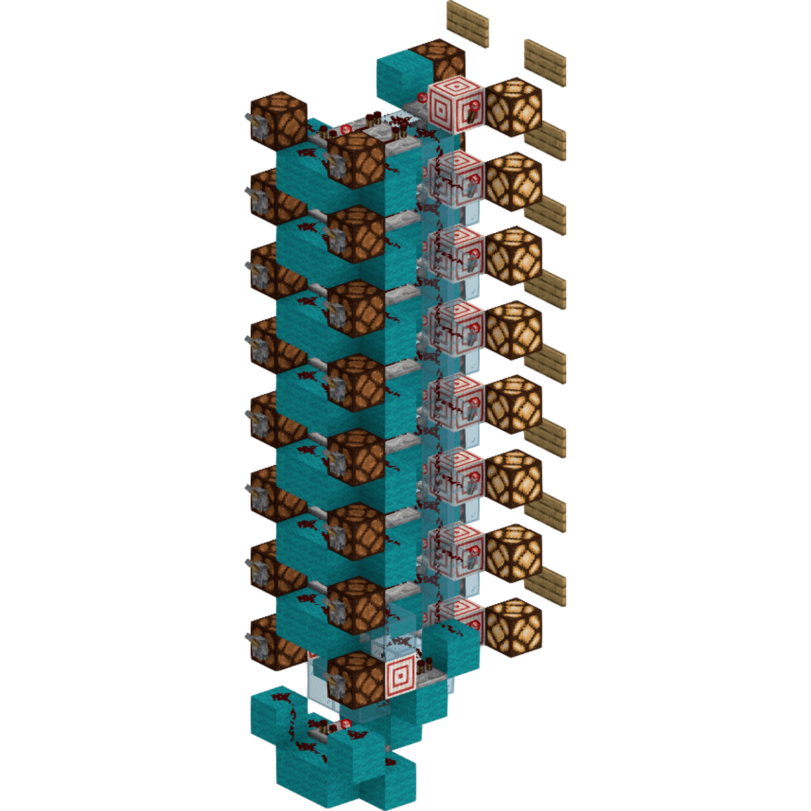
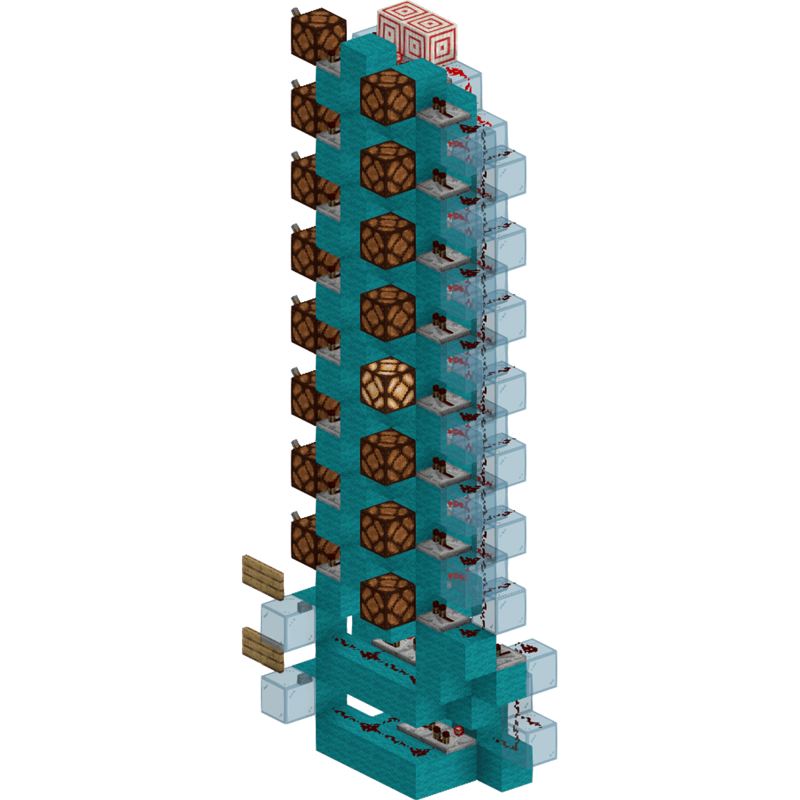
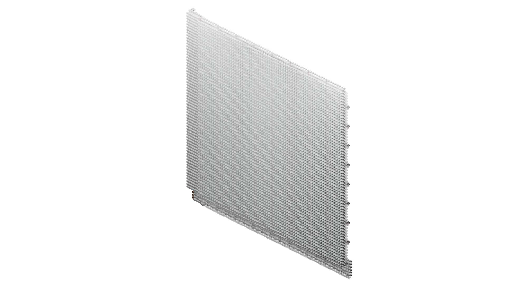
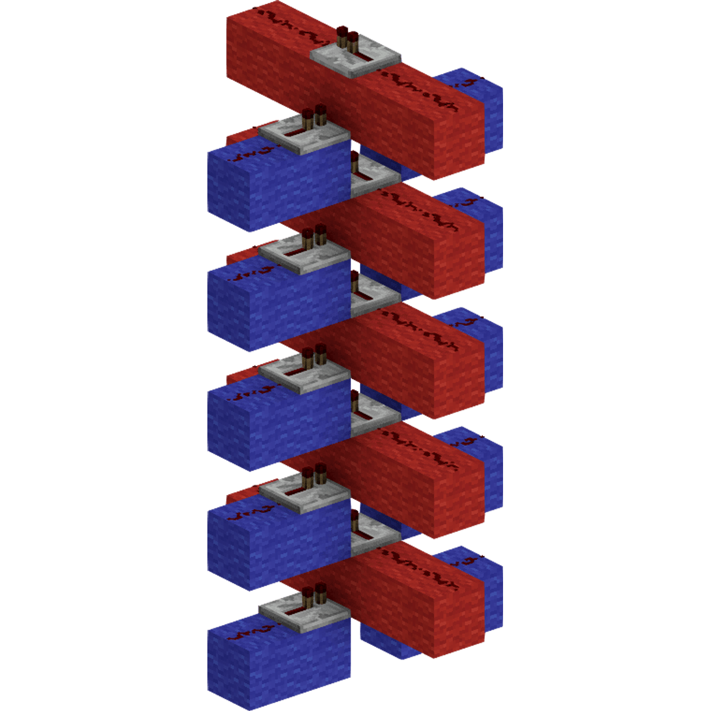
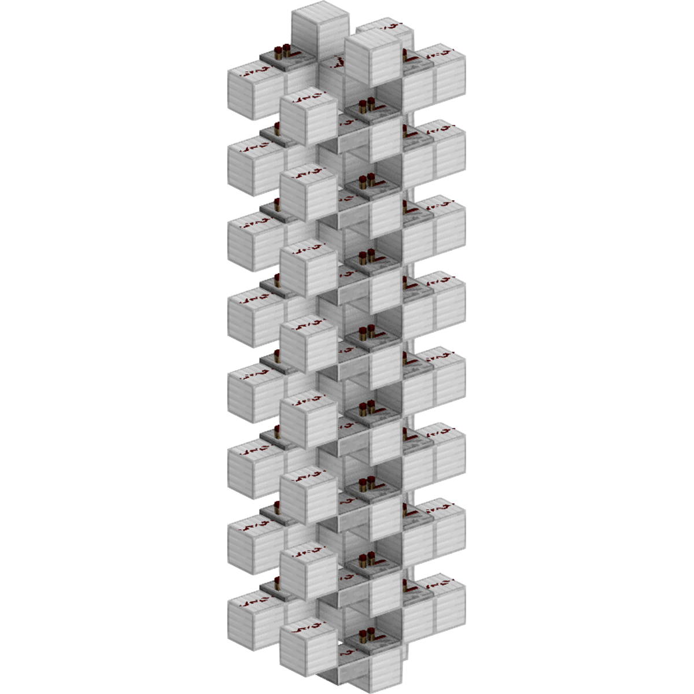

# 8x8 display bresenham one octant line renderer  
## formula  
  

## components  
  
1. 8x8 Display  
2. Incrementor with load function (x)  
3. Incrementor with load function (y)  
4. Magnitude comparator (x > x1)  
5. Subtractor (x1 - x0)  
6. Subtractor (y1 - y0)  
7. Subtractor (2*dy - dx)  
8. Subtractor (D - 2*dx)  
9. Adder (D + dy*2)  

## starting values  
| Item | Size | Mode | Range |
|------|------|------|-------|
| Input         | 3b | unsigned | 0..7 |
| dx = x0 - x1  | 3b | unsigned | 0..7 |
| D = 2*dy - dx | 5b | unsigned | 0..31 |

## loop logic  
| Item | Size | Mode | Range |
|------|------|------|-------|
| y = y + 1     | 3b | unsigned | 0..7 |
| D = D - 2*dx  | 5b | unsigned | 0..31 |
| D = D + 2*dy  | 5b | unsigned | 0..31 |

## other  
| Item | Size | Mode | Range |
|------|------|------|-------|
| Display | 3b | unsigned | 0..7 |

_These sizes are not required. I tried them at random before understanding and they worked. Assuming `0 < x0 < x1` you will mostly use 3b unsigned, and when you multiply by 2 you might need 4b or even 5b unsigned._  

# 64x64 display bresenham all octant line renderer  
## formula  
  

## components  
  
1. 64x64 Display  
2. Incrementor with load function (x)  
3. Incrementor with load function (y)  
5. Subtractor (x1 - x0)  
6. Subtractor (y1 - y0)  
7. ..

## starting values  
| Item | Size | Mode | Range | Reasoning |
|------|------|------|-------|-----------|
| Input                 | 6b    | 2s-complement | -32..31   | I want a 64x64 display |
| x1 - x0               | 7b    | 2s-complement | -64..63   | limits: `-32 - 31 = -63` and `31 - 0 = 31` |
| dx = abs(x1 - x0)     | 6b    | unsigned      | 0..63     | same size but no signed bit |
| sx = sign(x1 - x0)    | ANY   | 2s-complement | ANY       | just extend the top bit |
| Interchange           | 1b    | unsigned      | 0..1      | boolean |
| E = 2*dy - dx         | 8b    | 2s-complement | -128..127 | limits: `2*0 - 63 = -63` and `2*63 - 0 = 126` |
| A = 2*dy              | 7b    | unsigned      | 0..127    | limit: `2*63 = 126` |
| B = 2*(dy - dx)       | 8b    | 2s-complement | -128..127 | limits: `2*(0 - 63) = -126` and `2*(63 - 0) = 126` |

## loop logic  
| Item | Size | Mode | Range | Reasoning |
|------|------|------|-------|-----------|
| x = x + sx    | 6b | 2s-complement | -32..31 | display is 6b unsigned |
| E = E + A     | 7b | 2s-complement | -64..63 | testing limit cases |
| E = E + B     | 7b | 2s-complement | -64..63 | testing limit cases |

## other  
| Item | Size | Mode | Range | Reasoning |
|------|------|------|-------|-----------|
| Display | 6b | unsigned | 0..63 | adding +32 to X and Y input |

## TEST CASE (24, 8) → (10, 30)  
### starting values  
| Code | Decimal | Bits | Size | Mode | Comment |
|------|---------|---|------|------|---------|
| x0                    | **24**                        | **--01 1000** | 6b    | 2s-complement | # |
| x1                    | **10**                        | **--00 1010** | 6b    | 2s-complement | # |
| y0                    | **8**                         | **--00 1000** | 6b    | 2s-complement | # |
| y1                    | **30**                        | **--01 1110** | 6b    | 2s-complement | # |
| x1 - x0               | 10 - 24 = **-14**             | **-111 0010** | 7b    | 2s-complement | # |
| y1 - y0               | 30 - 8 = **22**               | **-001 0110** | 7b    | 2s-complement | # |
| dx = abs(x1 - x0)     | abs(-14) = **14**             | **--00 1110** | 6b    | unsigned      | # |
| dy = abs(y1 - y0)     | abs(22) = **22**              | **--01 0110** | 6b    | unsigned      | # after this, dx and dy are swapped |
| sx = sign(x1 - x0)    | sign(-14) = **-1**            | **1111 1111** | ANY   | 2s-complement | # |
| sy = sign(y1 - y0)    | sign(22) = **1**              | **0000 0001** | ANY   | 2s-complement | # |
| A = 2*dy              | 2*14 = **28**                 | **-001 1100** | 7b    | unsigned      | # |
| E = 2*dy - dx         | 2*14 - 22 = 28 - 22 = **6**   | **0000 0110** | 8b    | 2s-complement | # |
| dy - dx               | 14 - 22 = **-8**              | **-111 1000** | 7b    | 2s-complement | # subtracting two 6 bit unsigned numbers | 
| B = 2*(dy - dx)       | 2*(14 - 22) = 2*-8 = **-16**  | **1111 0000** | 8b    | 2s-complement | # |

### loop logic
| Itteration | E < 0 | interchange | y += sy | x += sx | E += A | E += B | new E | new Position |
|------------|-------|-------------|---------|---------|--------|--------|-------|--------------|
| start | | | | | | | **6** | **(24, 8)** |
| 0 | (6) no    | (22>14) yes   | x   | x   |     | x   | 6 + -16 = **-10** | (24, 8) + (-1, 1) = **(23, 9)** |
| 1 | (-10) yes | (22>14) yes   | x   |     | x   |     | -10 + 28 = **18** | |
| 2 | (18) no   | (22>14) yes   |
| 3 | ..        | (22>14) yes   |
| 4 | ..        | (22>14) yes   |
| 5 | ..        | (22>14) yes   |
| 6 | ..        | (22>14) yes   |
| 7 | ..        | (22>14) yes   |
| 8 | ..        | (22>14) yes   |
| 9 | ..        | (22>14) yes   |
| 10 | ..       | (22>14) yes   |
| 11 | ..       | (22>14) yes   |
| 12 | ..       | (22>14) yes   |
| 13 | ..       | (22>14) yes   |
| 14 | ..       | (22>14) yes   |
| 15 | ..       | (22>14) yes   |
| 16 | ..       | (22>14) yes   |
| 17 | ..       | (22>14) yes   |
| 18 | ..       | (22>14) yes   |
| 19 | ..       | (22>14) yes   |
| 20 | ..       | (22>14) yes   |
| 21 | ..       | (22>14) yes   |
| 22 | ..       | (22>14) yes   |

_TODO!_

# 8b Carry Cancel Adder  
  
# 8b Instant Signum
  
# 8b Absolute Value  
  
# 8b Magnitude Comparator with Equals  
    
# 8b Counter with Load
  
# 64x64 Matrix Decoder  
  
# Classic Crosswire  
  
# 8b Swapper  
  