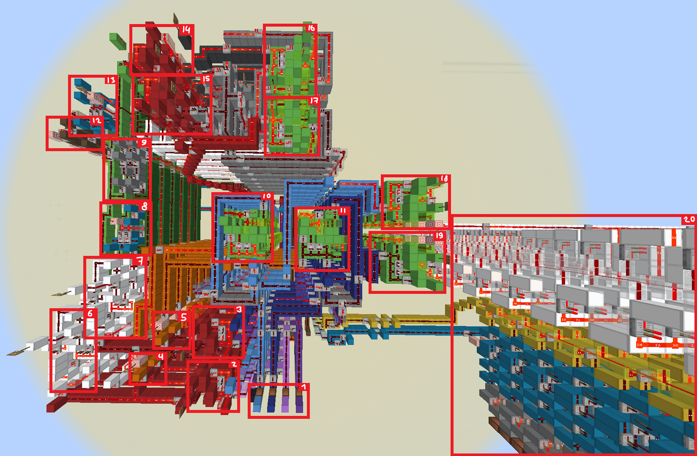

# 8x8 display bresenham one octant line renderer  
## formula  
  

## components  
  
1. 8x8 Display  
2. Incrementor with load function (x)  
3. Incrementor with load function (y)  
4. Magnitude comparator (x > x1)  
5. Subtractor (x1 - x0)  
6. Subtractor (y1 - y0)  
7. Subtractor (2*dy - dx)  
8. Subtractor (D - 2*dx)  
9. Adder (D + dy*2)  

## starting values  
| Item | Size | Mode | Range |
|------|------|------|-------|
| Input         | 3b | unsigned | 0..7 |
| dx = x0 - x1  | 3b | unsigned | 0..7 |
| D = 2*dy - dx | 5b | unsigned | 0..31 |

## loop logic  
| Item | Size | Mode | Range |
|------|------|------|-------|
| y = y + 1     | 3b | unsigned | 0..7 |
| D = D - 2*dx  | 5b | unsigned | 0..31 |
| D = D + 2*dy  | 5b | unsigned | 0..31 |

## other  
| Item | Size | Mode | Range |
|------|------|------|-------|
| Display | 3b | unsigned | 0..7 |

_These sizes are not required. I tried them at random before understanding and they worked. Assuming `0 < x0 < x1` you will mostly use 3b unsigned, and when you multiply by 2 you might need 4b or even 5b unsigned._  

# 64x64 display bresenham all octant line renderer  
## components  
  
1. Input  
2. Carry Cancel Adder (subtraction) `y1 - y0`  
3. Carry Cancel Adder (subtraction) `x1 - x0`  
4. Signum `x1 - x0`  
5. Signum `y1 - x0`  
6. Absolute value `x1 - x0`  
7. Absolute value `y1 - y0`  
8. Magnitude comparator `dy > dx`  
9. Swapper `dy <> dx`  
10. Carry Cancel Adder (addition) `x += sx`  
11. Carry Cancel Adder (addition) `y += sy`  
12. Incrementor with Load `x=0`, `x++`  
13. Magnitude comparator `x >= dx`  
14. Carry Cancel Adder (subtraction) `2*(dy - dx)`  
15. Carry Cancel Adder (subtraction) `2*dy - dx`  
16. Carry Cancel Adder (addition) `E += B`  
17. Carry Cancel Adder (addition) `E += A`  
18. Carry Cancel Adder (addition) `x += 32`  
19. Carry Cancel Adder (addition) `y += 32`  
20. 64x64 Display  

## starting values  
| Item | Size | Mode | Range | Reasoning |
|------|------|------|-------|-----------|
| Input                 | 6b    | 2s-complement | -32..31   | I want a 64x64 display |
| x1 - x0               | 7b    | 2s-complement | -64..63   | limits: `-32 - 31 = -63` and `31 - 0 = 31` |
| dx = abs(x1 - x0)     | 6b    | unsigned      | 0..63     | same size but no signed bit |
| sx = sign(x1 - x0)    | ANY   | 2s-complement | ANY       | just extend the top bit |
| Interchange           | 1b    | unsigned      | 0..1      | boolean |
| E = 2*dy - dx         | 8b    | 2s-complement | -128..127 | limits: `2*0 - 63 = -63` and `2*63 - 0 = 126` |
| A = 2*dy              | 7b    | unsigned      | 0..127    | limit: `2*63 = 126` |
| B = 2*(dy - dx)       | 8b    | 2s-complement | -128..127 | limits: `2*(0 - 63) = -126` and `2*(63 - 0) = 126` |

## loop logic  
| Item | Size | Mode | Range | Reasoning |
|------|------|------|-------|-----------|
| x = x + sx    | 6b | 2s-complement | -32..31 | display is 6b unsigned |
| E = E + A     | 7b | 2s-complement | -64..63 | testing limit cases |
| E = E + B     | 7b | 2s-complement | -64..63 | testing limit cases |

## other  
| Item | Size | Mode | Range | Reasoning |
|------|------|------|-------|-----------|
| Display | 6b | unsigned | 0..63 | adding +32 to X and Y input |

## TEST CASE (24, 8) → (10, 30)  
### starting values  
| Code | Decimal | Bits | Size | Mode | Comment |
|------|---------|---|------|------|---------|
| x0                    | **24**                        | **--01 1000** | 6b    | 2s-complement | |
| x1                    | **10**                        | **--00 1010** | 6b    | 2s-complement | |
| y0                    | **8**                         | **--00 1000** | 6b    | 2s-complement | |
| y1                    | **30**                        | **--01 1110** | 6b    | 2s-complement | |
| x1 - x0               | 10 - 24 = **-14**             | **-111 0010** | 7b    | 2s-complement | |
| y1 - y0               | 30 - 8 = **22**               | **-001 0110** | 7b    | 2s-complement | |
| dx = abs(x1 - x0)     | abs(-14) = **14**             | **--00 1110** | 6b    | unsigned      | |
| dy = abs(y1 - y0)     | abs(22) = **22**              | **--01 0110** | 6b    | unsigned      | after this, dx and dy are swapped |
| sx = sign(x1 - x0)    | sign(-14) = **-1**            | **1111 1111** | ANY   | 2s-complement | |
| sy = sign(y1 - y0)    | sign(22) = **1**              | **0000 0001** | ANY   | 2s-complement | |
| A = 2*dy              | 2*14 = **28**                 | **-001 1100** | 7b    | unsigned      | |
| E = 2*dy - dx         | 2*14 - 22 = 28 - 22 = **6**   | **0000 0110** | 8b    | 2s-complement | |
| dy - dx               | 14 - 22 = **-8**              | **-111 1000** | 7b    | 2s-complement | subtracting two 6 bit unsigned numbers | 
| B = 2*(dy - dx)       | 2*(14 - 22) = 2*-8 = **-16**  | **1111 0000** | 8b    | 2s-complement | |

### loop logic
| Itteration | E < 0 | interchange | y += sy | x += sx | E += A | E += B | new E | new Position |
|------------|-------|-------------|---------|---------|--------|--------|-------|--------------|
| start | | | | | | | **6** | **(24, 8)** |
| 0 | (6) no    | (22>14) yes   | x | x |   | x | 6 + -16 = **-10** | (24, 8) + (-1, 1) = **(23, 9)** |
| 1 | (-10) yes | (22>14) yes   | x |   | x |   | -10 + 28 = **18** | (23, 9) + (0, 1) = **(23, 10)** |
| 2 | (18) no   | (22>14) yes   | x | x |   | x | 18 + -16 = **2**  | (23, 10) + (-1, 1) = **(22, 11)** |
| 3 | (2)  no   | (22>14) yes   | x | x |   | x | 2 + -16 = **-14**   | (22, 11) + (-1, 1) = **(21, 12)** |
| .. |

## TEST CASE (22, 18) → (4, 14)  
### starting values  
| Code | Deciaml | Bits | Size | Mode | Comment |
|------|---------|------|------|------|---------|
| x0                    | **22**                        | **--01 0110** | 6b    | 2s-complement ||
| x1                    | **4**                         | **--00 0100** | 6b    | 2s-complement ||
| y0                    | **18**                        | **--01 0010** | 6b    | 2s-complement ||
| y1                    | **14**                        | **--00 1110** | 6b    | 2s-complement ||
| dx = abs(x1 - x0)     | abs(-18) = **18**             | **--01 0010** | 6b    | unsigned ||
| dy = abs(y1 - y0)     | abs(-4) = **4**               | **--00 0100** | 6b    | unsigned | dx and dy do not get swapped |
| sx = sign(x1 - x0)    | sign(-18) = **-1**            | **1111 1111** | ANY   | 2s-complement ||
| sy = sing(y1 - y0)    | sign(-4) = **-1**             | **1111 1111** | ANY   | 2s-complement ||
| A = 2*dy              | 2*4 = **8**                   | **-000 1000** | 7b    | unsigned ||
| E = 2*dy - dx         | 2*4 - 18 = 8 - 18 = -10       | **1111 0110** | 8b    | 2s-complement ||
| dy - dx               | 4 - 18 = **-14**              | **-111 0010** | 7b    | 2s-complement ||
| B = 2*(dy - dx)       | 2*(4 - 18) = 2*(-14) = **-28**| **1110 0100** | 8b    | 2s-complement || 

### loop logic
| Itteration | E < 0 | interchange | y += sy | x += sx | E += A | E += B | new E | new Position |
|------------|-------|-------------|---------|---------|--------|--------|-------|--------------|
| start | | | | | | | **-10** | **(22, 18)** |
| 0 | (-10) yes | (4>18) no |   | x | x |   | -10 + 8 = **-2**  | (22, 18) + (0, -1) = **(22, 17)** |
| 1 | (-2) yes  | (4>18) no |   | x | x |   | -2 + 8 = **6**    | (22, 17) + (0, -1) = **(22, 16)** |
| 2 | (6) no    | (4>18) no | x | x |   | x | 6 + -28 = **-22** | (22, 16) + (-1, -1) = **(21, 15)** |
| 3 | (-22) yes | (4>18) no |   | x | x |   | -22 + 8 = **14**  | (21, 15) + (0, -1) = **(21, 14)** |
| .. |

## 3d cube wireframe  
| x0 | y0 | x1 | y1 | Part |
|----|----|----|----|------|
| 22    `010110`    | 18    `010010`    | 4     `000100` | 14   `001110` | top |
| 4     `000100`    | 14    `001110`    | -20   `101100` | 13   `001101` | top |
| -20   `101100`    | 13    `001101`    | -14   `110010` | 16   `010000` | top |
|-14    `110010`    | 16    `010000`    | 22    `010110` | 18   `010010` | top |
|-17    `101111`    | -14   `110010`    | 5     `000101` | -8   `111000` | bottom |
| 5     `000101`    | -8    `111000`    | 22    `010110` | -16  `110000` | bottom |
| 22    `010110`    | -16   `110000`    | -8    `111000` | -27  `100101` | bottom |
| -8    `111000`    | -27   `100101`    | -17   `101111` | -14  `110010` | bottom |
| -20   `101100`    | 13    `001101`    | -17   `101111` | -14  `110010` | middle |
| 5     `000101`    | -8    `111000`    | 4     `000100` | 14   `001110` | middle |
| 22    `010110`    | -16   `110000`    | 22    `010110` | 18   `010010` | middle |
| -8    `111000`    | -27   `100101`    | -14   `110010` | 16   `010000` | middle | 

# 8b Carry Cancel Adder  
  
# 8b Instant Signum
  
# 8b Absolute Value  
  
# 8b Magnitude Comparator with Equals  
    
# 8b Counter with Load
  
# 64x64 Matrix Decoder  
  
# Classic Crosswire  
  
# 8b Swapper  
  