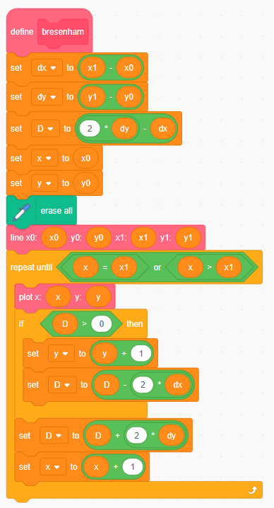
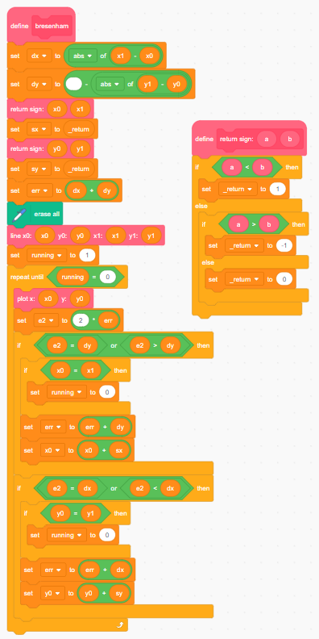
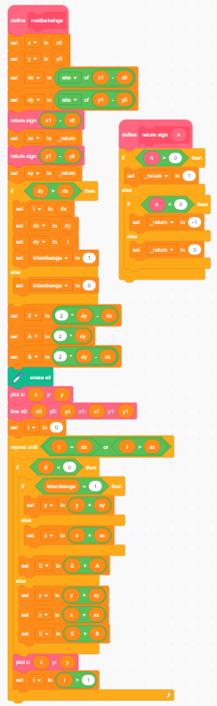

# Bresenham's Algorithm  
```py
dx = x1 - x0    # delta x
dy = y1 - y0    # delta y

D = 2*dy - dx   # binary shift 1<<

x = x0
y = y1

while x < x1:   # 5 bit magnitude comparator
    plot(x, y)

    if D > 0:   # NOT 2s complement MSB
        y = y + 1
        D = D - 2*dx

    D = D + 2*dy
```

# All octant line draws  
```py
dx = abs(x1 - x0)
dy = -abs(y1 - y0)

sx = (x0 < x1) ? 1 : -1
sy = (y0 < y1) ? 1 : -1

err = dx + dy

while true:
    plot(x0, y0)

    e2 = 2 * err

    if e2 >= dy:
        if x0 == x1 break
        err = err + dy
        x0 = x0 + sx

    if e2 <= dx:
        if y0 == y1 break
        err = err + dx
        y0 = y0 + sy
```
_from wikipedia_  

# Mattbatwings all octant line draws  
```py
x = x0
y = y0

dx = abs(x1 - x0)
dy = abs(y1 - y0)

sx = sign(x1 - x0)
sy = sign(y1 - y0)

if dy > dx:
    t = dx
    dx = dy
    dy = t
    interchange = 1
else:
    interchange = 0

E = 2*dy - dx
A = 2*dy
B = 2*(dy - dx)

plot(x, y)

for x from 0 to dx:
    if E < 0:
        if interchange == 1:
            y = y + sy
        else:
            x = x + sx
        E = E + A
    else:
        y = y + sy
        x = x + sx
        E = E + B
    
    plot(x, y)
```
_from mattbatwings_  

# Bresenham in scratch.mit.edu  
  

# All octant Bresenham in scratch.mit.edu  
  

# All octant Mattbatwings in scratch.mit.edu  
  